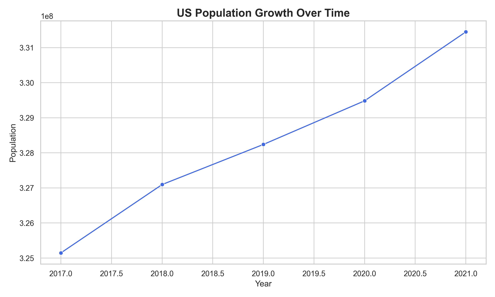

# 🇺🇸 DataUSA Capstone Project

This project demonstrates how to fetch, store, and visualize US population and income data using the **DataUSA API** (and a local backup for reliability).

## 🧠 Overview
The workflow:
1. **Fetch Data** → Using `requests` from the DataUSA API (or local JSON)
2. **Store Data** → Save into `datausa.db` SQLite database
3. **Analyze Data** → Visualize trends using `matplotlib`, `pandas`, and `seaborn`

## 🧩 Files
| File | Description |
|------|--------------|
| `fetch_data.py` | Fetches or loads data into SQLite |
| `analyze_data.py` | Reads data and generates charts |
| `datausa.db` | SQLite database containing census data |
| `us_population_trend.png` | Visualization of US population over years |

## 🖼️ Example Output


## 🛠️ Requirements
Install dependencies:
```bash
pip install requests pandas matplotlib seaborn

